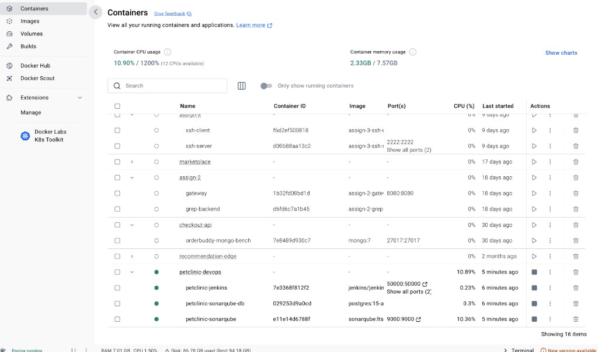
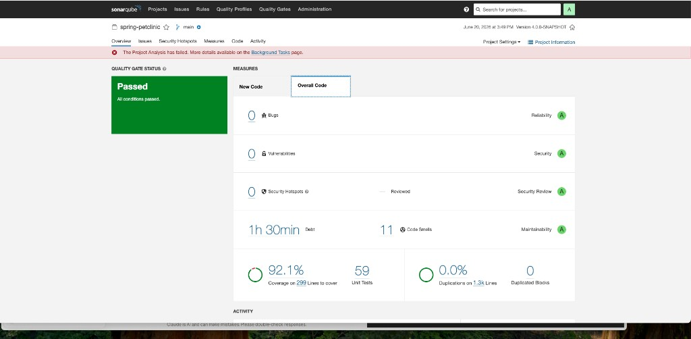
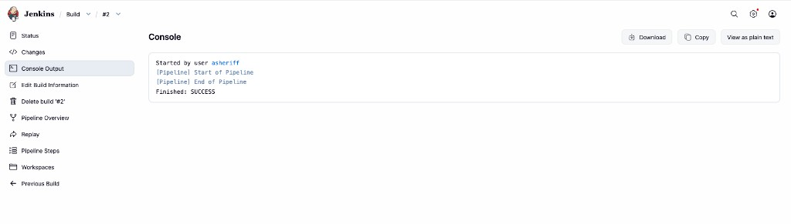
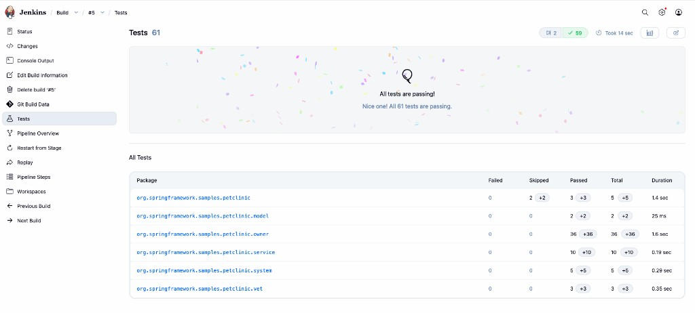

# DevOps Notes — Spring PetClinic (CMU MINI-5)

**Author:** akram_personal  
**Course:** MINI-5 DevOps Mini-project  
**Date started:** 20 June 2026  
**Fork:** https://github.com/asheriff-bot/spring-petclinic

---

## Why I set this up the way I did

When I started this mini-project, I thought the goal was not just to “run Jenkins and SonarQube somewhere,” but to show that I can wire a real application through a small DevOps stack: fork the code, put the tools in Docker, connect them on a shared network, and prove the pipeline actually builds and anaylzes the project.

I chose to keep everything under a `devops/` folder in my fork so a reviewer (or future me) can see what I did step by step — compose file, helper scripts, and a setup log — instead of only having containers running with no paper trail. I though that would make grading easier too.

---

## Architecture (what runs where)

All CI services sit on one custom bridge network called **`petclinic-devops-net`**.

```
┌─────────────────────────────────────────────────────────────┐
│                  petclinic-devops-net                        │
│                                                              │
│   ┌──────────────┐     ┌──────────────┐     ┌────────────┐  │
│   │   Jenkins    │────▶│  SonarQube   │────▶│ Postgres   │  │
│   │ :8081 (host) │     │ :9000 (host) │     │ (internal) │  │
│   └──────────────┘     └──────────────┘     └────────────┘  │
│         │                      ▲                             │
│         │   git checkout       │  sonar:sonar (Maven)       │
│         ▼                      │                             │
│   spring-petclinic repo (GitHub fork)                        │
└─────────────────────────────────────────────────────────────┘
```

From my laptop I use:

| Service   | URL |
|-----------|-----|
| Jenkins   | http://localhost:8081 |
| SonarQube | http://localhost:9000 |

Inside the network, Jenkins talks to SonarQube at **`http://sonarqube:9000`** (container hostname, not `localhost`). I learned that the hard way — putting `localhost:9000` in `pom.xml` would work on my Mac but fail inside the Jenkins container. Obvious in hindsight, but it took me a minute.

---

## Task checklist (assignment requirements)

| Requirement | What I did | Status |
|-------------|------------|--------|
| Docker container stack + base images | `devops/docker-compose.yml` — Jenkins, SonarQube, Postgres | Done |
| Fork + clone spring-petclinic | Forked to `asheriff-bot/spring-petclinic`, cloned locally | Done |
| Custom Docker network | `petclinic-devops-net` (bridge) | Done |
| Jenkins on the network | `petclinic-jenkins` | Done |
| SonarQube on the network | `petclinic-sonarqube` + `petclinic-sonarqube-db` | Done |

See **Figure 1** below for Docker Desktop proof of the running stack.

---

## Step-by-step — how I built it

### 1. Fork and clone

I forked the upstream repo from `spring-projects/spring-petclinic` into my GitHub acount and cloned it into my Mini-project folder:

```bash
git clone https://github.com/asheriff-bot/spring-petclinic.git
cd spring-petclinic
git remote -v
```

I verified the fork with:

```bash
gh repo view asheriff-bot/spring-petclinic --json isFork,parent,url
```

### 2. Create the Docker network

I thought a dedicated network was cleaner than relying on the default bridge — each service can reach the others by name (`jenkins`, `sonarqube`, `sonarqube-db`). Seperate network felt more “real” than just default docker networking.

```bash
./devops/scripts/01-create-network.sh
```

Or manually:

```bash
docker network create \
  --driver bridge \
  --label project=spring-petclinic \
  --label env=mini5-devops \
  petclinic-devops-net
```

### 3. Start the stack

I put the compose file and scripts under `devops/` and used:

```bash
chmod +x devops/scripts/*.sh
./devops/scripts/02-start-stack.sh
```

Base images I pulled:

- `jenkins/jenkins:lts-jdk17`
- `sonarqube:lts-community`
- `postgres:15-alpine`

Check everything is up (or atleast that is what I run every time):

```bash
docker compose -f devops/docker-compose.yml ps
docker network inspect petclinic-devops-net
```

**Figure 1 — Docker Desktop: `petclinic-devops` stack running**



*Screenshot I took from Docker Desktop. All three containers are up — Jenkins on port 8081, SonarQube on 9000, and the Postgres DB behind SonarQube (no host port, which is what I wanted).*

### 4. First login to Jenkins

On first start, Jenkins prints an initial admin password:

```bash
docker exec petclinic-jenkins cat /var/jenkins_home/secrets/initialAdminPassword
```

I completed the setup wizard, installed the suggested plugins (including Pipeline and Git), and created my admin user. Took longer than I expected tbh.

### 5. CI pipeline

I added a **`Jenkinsfile`** at the repo root and SonarQube settings in **`pom.xml`**. The pipeline does three things:

1. **Checkout** — clone `main` from my fork  
2. **Build & Test** — `./mvnw -B verify`  
3. **SonarQube Analysis** — `./mvnw -B sonar:sonar -DskipTests`  
4. **Quality Gate** — `waitForQualityGate abortPipeline: true`

I mapped Jenkins to port **8081** on purpose because I might run the PetClinic app itself on **8080** later.

---

## SonarQube credentials (what tripped me up)

This took longer than I expected, so I am writting it down clearly.

### What I tried first

I created a credential called `sonarqube-token` under **my user profile** (`asheriff → Credentials`). Jenkins showed it in the UI, but the pipeline still printed *“Skipping SonarQube”* on Build **#5**.

### What I figured out

The pipeline uses:

```groovy
withCredentials([string(credentialsId: 'sonarqube-system-token', variable: 'SONAR_TOKEN')])
```

That lookup expects the credential in **Manage Jenkins → Credentials → System → Global credentials**, not under a user account. I also learned that credential IDs must be **unique across the whole Jenkins instance** — when I tried to add the same ID under System, Jenkins warned me its already in use under my user.

### What worked

1. I generated a token in SonarQube: **My Account → Security → Generate Token**  
2. I added **Secret text** under **System → Global** with ID **`sonarqube-system-token`**  
3. I updated the pipeline to use that ID and re-ran the job  

Build **#7** finished with:

```text
ANALYSIS SUCCESSFUL, you can find the results at:
http://sonarqube:9000/dashboard?id=spring-petclinic
```

**Figure 4 — SonarQube: `spring-petclinic` project dashboard**



*I noticed SonarQube sometimes shows a red banner about a background task even when the Quality Gate says Passed — I thought that was confusing at first, but the metrics and gate status are from the successful scan (Build #7).*

---

## Proof the pipeline is real (not a empty job)

Early builds (**#1–#4**) finished in milliseconds — that was an empty pipeline script. I thought everything was fine because Jenkins showed a green checkmark, but nothing was actually compiling.

**Figure 2 — Jenkins Build #2: empty pipeline (false success)**



*This is the screenshot that made me realize something was wrong — green checkmark, but the log is basically empty. No `git`, no Maven, nothing.*

Build **#5** was the first real run (~99 seconds): **61 tests**, 59 passed, 2 skipped, 0 failed.

**Figure 3 — Jenkins Build #5: unit tests passing**



*I saved this one because it proves the Maven test stage actually ran — not just a fast fake SUCCESS.*

Build **#7** was the first full run with SonarQube (~102 seconds): build, tests, and analysis all succeded. (Figure 4 above is the SonarQube side of that same milestone.)

---

## Useful commands I keep at hand

**Start stack**

```bash
./devops/scripts/02-start-stack.sh
```

**Stop stack (keep data)**

```bash
./devops/scripts/03-stop-stack.sh
```

**Stop stack and remove volumes**

```bash
./devops/scripts/03-stop-stack.sh -v
```

**Configure SonarQube plugin + Quality Gate support in Jenkins**

```bash
./devops/scripts/05-configure-sonarqube-jenkins.sh
./devops/scripts/04-configure-jenkins-pipeline.sh
```

**Re-apply Jenkins job config from embedded pipeline script**

```bash
./devops/scripts/04-configure-jenkins-pipeline.sh
```

**Tail Jenkins build log (example: build 7)**

```bash
docker exec petclinic-jenkins tail -f /var/jenkins_home/jobs/Build/builds/7/log
```

---

## Files I added (for reviewers)

| Path | Purpose |
|------|---------|
| `devops/docker-compose.yml` | Jenkins + SonarQube + Postgres stack |
| `devops/scripts/01-create-network.sh` | Create `petclinic-devops-net` |
| `devops/scripts/02-start-stack.sh` | Pull images and start containers |
| `devops/scripts/03-stop-stack.sh` | Stop stack (`-v` to drop volumes) |
| `devops/scripts/04-configure-jenkins-pipeline.sh` | Embed pipeline in Jenkins `Build` job |
| `devops/scripts/05-configure-sonarqube-jenkins.sh` | SonarQube plugin + server for Quality Gate |
| `devops/SETUP-LOG.md` | Short command-oriented setup log |
| `devops/JENKINS-PIPELINE-SETUP.md` | Pipeline + credential instructions |
| `Jenkinsfile` | Declarative CI pipeline |
| `pom.xml` (Sonar section) | SonarQube Maven plugin + project key |
| `devops/docs/screenshots/` | Labeled proof screenshots (see index below) |

---

## Screenshot index (quick reference)

| Figure | File | What it proves |
|--------|------|----------------|
| **Figure 1** | `devops/docs/screenshots/01-docker-desktop-petclinic-devops-stack.png` | Docker stack + base images running on compose project `petclinic-devops` |
| **Figure 2** | `devops/docs/screenshots/02-jenkins-build-02-empty-pipeline.png` | Early mistake — Jenkins job succeeded without doing any work |
| **Figure 3** | `devops/docs/screenshots/03-jenkins-build-05-unit-tests-passing.png` | Real CI — 61 tests executed, all passing (2 skipped) |
| **Figure 4** | `devops/docs/screenshots/04-sonarqube-spring-petclinic-quality-gate.png` | SonarQube analysis uploaded — Quality Gate Passed, 92.1% coverage |

I kept the files under `devops/docs/screenshots/` so paths stay stable if someone clones the fork. There is also a short `README.md` in that folder with the same labels.

---

## Known quirks (not blockers)

**SonarQube shows `(unhealthy)` in `docker ps`**

I fixed this later by changing the compose healthcheck to use bash `/dev/tcp` against the SonarQube API (the old check used `curl`, which is not in the image). After `./devops/scripts/02-start-stack.sh` or recreating the container, it should show healthy.

**Quality Gate in the pipeline**

I added a **Quality Gate** stage with `waitForQualityGate abortPipeline: true` so the build fails if code quality regresses. This needs the SonarQube Jenkins plugin — I install it with `./devops/scripts/05-configure-sonarqube-jenkins.sh`.

**Build #6 stalled after a Jenkins restart**

I restarted Jenkins while a build was running (after updating the job config). The log showed *“Pausing / Resuming after Jenkins restart”* and then stopped moving. I cancelled it and ran **Build Now** again — **#7** completed cleanly. Lesson: dont restart Jenkins mid-pipeline.

**Default SonarQube password**

On first login SonarQube uses `admin` / `admin` and forces a password change. I changed mine during setup.

---

## What I would do next (optional improvements)

If I had more time for bonus work, I would:

- Trigger builds from GitHub webhooks instead of manual **Build Now**
- Archive the built JAR as a Jenkins artifact
- Add the PetClinic app container to the same compose network

---

## Summary

I forked spring-petclinic, stood up Jenkins and SonarQube on a custom Docker network, and wired a Maven pipeline that builds, tests, and publishes analysis to SonarQube. The assignment tasks are complete; the meaningful proof is **Build #7** — real compile time, **61 tests**, and a **`spring-petclinic`** project visible in SonarQube.

If something breaks when you reproduce this, start with: stack running → credentials under **System → Global** → **Build Now** and read the console log. That is usually where the answer is (atleast for me it was).

---

*Last updated: 20 June 2026*
